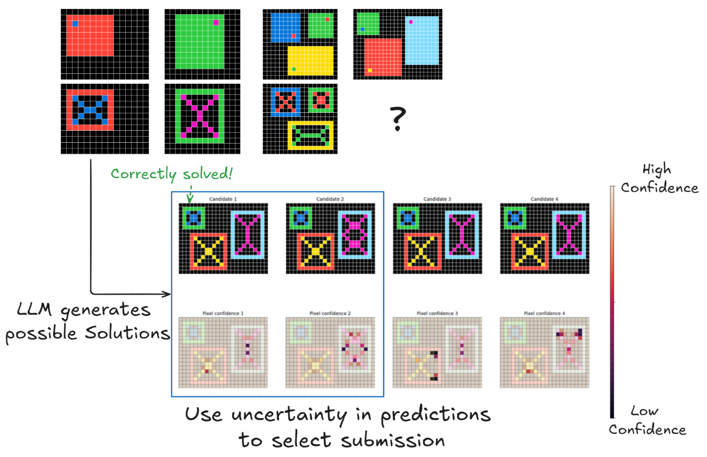
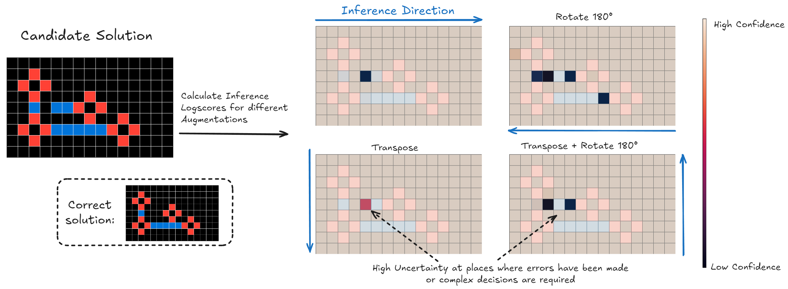

---
# ---------- Core metadata ----------
title:  "Product of Experts with LLMs:"
subtitle: "Boosting Performance on ARC is a Matter of Perspective"
description: >
  This work presents a method that significantly improves performance on the Abstraction and Reasoning Corpus (ARC) by leveraging task-specific data augmentations, depth-first search algorithms, and large language models (LLMs) as both generators and scorers.
keywords:
  - ARC
  - Abstract Reasoning
  - Large Language Models
  - Data Augmentation
  - Depth-First Search
  - Product of Experts

# ---------- Authorship ----------
author-meta: "Daniel Franzen, Jan Disselhoff, David Hartmann"
authors:
  - name: "Daniel Franzen"
    affiliations:
      - 1
      - ' *'
    url: "https://www.linkedin.com/in/daniel-franzen-9609b7334/"
  - name: "Jan Disselhoff"
    affiliations:
      - 1
      - ' *'
    url: "https://www.linkedin.com/in/jan-disselhoff-1423a2240/"
  - name: "David Hartmann"
    affiliations:
      - 2
      - ' *'
    url: "https://www.linkedin.com/in/david-hartmann-aa0334274/"
affiliations:
  - id: 1
    name: "JGU Mainz"
    url: "https://www.linkedin.com/in/david-hartmann-aa0334274/"
  - id: 2
    name: "Lambda, Inc."
  - id: ' *'
    name: "“The ARChitects” Kaggle team members"


# ---------- Links shown as buttons ----------
links:
  - label: "Paper (HTML)"
    url: "https://arxiv.org/html/2505.07859v1"
    icon: "file-alt"
  - label: "Paper (PDF)"
    url: "https://arxiv.org/pdf/2505.07859v1" 
    icon: "file-pdf"
  - label: "OpenReview"
    url: "https://openreview.net/forum?id=dsBjxI6l8W"
    icon: "comments"
  - label: "Code (GitHub)"
    url: "https://github.com/da-fr/Product-of-Experts-ARC-Paper"
    icon: "code"
  - label: "Model"
    url: "https://huggingface.co/da-fr/Mistral-NeMo-Minitron-8B-ARChitects-ReArc1200-bnb-4bit"
    icon: ""
    emoji: "🤗"
  - label: "ARC Kaggle Competition 2024"
    url: "https://www.kaggle.com/competitions/arc-prize-2024/leaderboard"
    icon: "trophy"

# ---------- Optional SEO / social ----------
canonical: "https://arxiv.org/abs/2505.07859"
hero_image: "arc_example.png"  # Replace with an appropriate image from the paper

# ---------- Footer ----------
owner:  "Daniel Franzen, Jan Disselhoff, David Hartmann"
year:   2025
license: "CC BY-SA 4.0"
license_url: "https://creativecommons.org/licenses/by-sa/4.0/"
---

<div class="text-center -mt-20 text-gray-600">
  Jump to: [TL;DR](#tldr), [Introduction](#introduction), [Method](#method), [Key Insights](#key-insights), [Conclusion](#conclusion), [Acknowledgements](#acknowledgements), [Related Links](#related-links), [Cite](#bibtex)
</div>


## TL;DR {#tldr}
We boost performance on the ARC reasoning benchmark by using the same LLM in two ways: (1) generating diverse solutions with depth-first search and (2) combine the same model' scores of solutions from different perspectives using an "[Product of Expert (Hinton, 1999)](https://www.cs.toronto.edu/~fritz/absps/icann-99.html)" approach. Our method solves 71.6% of tasks at very low cost (~2ct/task).


<div class="mt-10">
  
</div>


## Introduction
The Abstraction and Reasoning Corpus for Artificial General Intelligence (ARC-AGI) represents a particularly challenging benchmark in AI research. Unlike traditional ML challenges that reward crystallized knowledge, ARC-AGI focuses on fluid intelligence-the ability to reason about novel problems without specific prior training. Introduced by [François Chollet in 2019](https://arxiv.org/abs/1911.01547), the benchmark explicitly measures general reasoning capabilities, making it a critical test for progress toward AGI.

### Why ARC-AGI Represents a Key AGI Benchmark

ARC-AGI tests fluid intelligence rather than task-specific skills, making it a necessary benchmark for AGI evaluation:

* Evaluates abstract reasoning and adaptability to novel problems
* Serves as a necessary (but not sufficient) condition for AGI capabilities
* A systematic test to measure the reasoning gap between human and artificial intelligence
* Remains challenging for conventional deep learning approaches

The "AGI" designation indicates that systems unable to solve these tasks clearly fall short of general intelligence, rather than implying that success demonstrates full AGI capabilities.

## Method

Our approach comprises several key components:

1. **Task-Specific Data Augmentations**: We apply data augmentations tailored to the unique characteristics of ARC tasks during training, generation, and scoring phases to enhance model robustness.
  
2. **Depth-First Search Algorithm**: A depth-first search (DFS) algorithm is employed on LLM predictions to generate a diverse set of high-probability candidate solutions.
  
3. **LLM as Generator and Scorer**: The same LLM is utilized both to generate candidate solutions and to score them, using output probabilities to select the most promising solutions.
  
4. **Product of Experts (PoE)**: We implement a PoE approach to combine multiple model outputs, refining the selection of candidate solutions.
  


## Key Insights
Large language models (LLMs) demonstrate surprisingly strong capabilities in solving ARC tasks end-to-end, effectively uncovering complex underlying patterns. Critically, we found that these models excel more at evaluating potential solutions than at generating them directly. Leveraging this insight, we employed a depth-first search to efficiently explore possible solutions and then used the same LLM to reliably identify the most promising candidate.

Specifically, our key findings include:

1. **Enhanced Performance through Data Variation**
    - Applying transformations such as rotation, grid transposition, and color substitution significantly boosts LLM performance.
    - Providing multiple perspectives on tasks helps overcome inherent limitations, like the autoregressive generation process of LLMs.
2. **Efficient Solution Candidate Generation**
    - Standard greedy and stochastic sampling methods were unreliable in generating the correct solution, even with adjusted parameters.
    - Employing a depth-first search guided by the LLM's evaluation of potential paths greatly improved the chance of finding the correct solution.
3. **Effective Solution Selection**
    - Ensemble scoring across diverse augmentations yields more consistent and reliable evaluations.
    - Our "Product-of-Experts" method for combining the scores of different augmentations emerged as a powerful and effective approach for selecting the correct solution.


### Key Figures
The two key plots of our work underline the impact of both contributions in isolation. 

<div class="md:mx-20">

</div>

<div class="md:mx-20">
![**Performance impact of Product of Expert selection**: Accuracy and coverage of different selection methods as a function of the confidence threshold T. The solid black line shows the proportion of tasks where the correct solution is among the generated candidates. The solid colored lines show what percentage of the tasks would be solved using different aggregation methods (top-2 accuracy), while the dotted lines show how this percentage relates to the black line. Our product of probabilities approach performs best among the tested aggregation methods.](images/accuracy_selection_methods.png)
</div>

### Comparative Analysis
Our method achieves a score of 71.6% (286.5/400 solved tasks) on the public ARC-AGI evaluation set, demonstrating state-of-the-art performance among publicly available approaches. Notably, this performance is achieved with a remarkably low inference cost, averaging only around 2 cents per task on readily available hardware.

To contextualize our results, we compare our method with other approaches:

| Method             | Score (%) | Open Source Weights  | Inference Cost per Task |
|--------------------|-----------|----------------------|-------------------------|
| Our Method         | 71.6      | yes                  | ~$0.02                  |
| Average Human      | 60.2      | ?                    | ?                       |
| OpenAI's o3        | 82.8      | no                   | ~$17                    |

*Table 1: Comparative performance on ARC-AGI evaluation set.*


## Conclusion

By integrating task-specific data augmentations, a depth-first search algorithm, and leveraging LLMs as both generators and scorers, our method significantly enhances performance on the ARC-AGI benchmark. This approach underscores the potential of combining strategic data processing techniques with powerful language models to tackle complex abstract reasoning tasks.

## Acknowledgements
We sincerely thank [Lambda](https://lambda.ai) for providing 8xH100 GPUs that enabled rapid iteration of our ideas. This work was supported by the [Carl-Zeiss-Stiftung](https://carl-zeiss-stiftung.d) through the "Research Center for Algorithmic Intelligence as an Emergent Phenomenon" and by the [Deutsche Forschungsgemeinschaft](https://dfg.de) (DFG, German Research Foundation), project 233630050 (TRR 146).


## Related Links
- Our [GTC'25 Talk](https://www.nvidia.com/en-us/on-demand/session/gtc25-s74252/) focusing on the competition and the technical aspects of this project
- The [arcprize.org](https://arcprize.org) project and last year's [ARC Kaggle Competition 2024](https://www.kaggle.com/competitions/arc-prize-2024/leaderboard) that initiated this work.


## BibTeX {#bibtex}
If you consider citing us, feel free to use the bibtex-entry below.

<div class="code-block-wrapper">
  <button class="copy-button">Copy</button>

```bibtex
@article{poeforllms2025arc,
  author={Daniel Franzen and Jan Disselhoff and David Hartmann},
  title={Product of Experts for LLMs: Boosting Performance on ARC is a Matter of Perspective},
  booktitle    = {Forty-second International Conference on Machine Learning, {ICML} 2025, Vancouver, Canada},
  publisher    = {OpenReview.net},
  year={2025},
  url          = {https://openreview.net/forum?id=dsBjxI6l8W},
}
```
</div>
