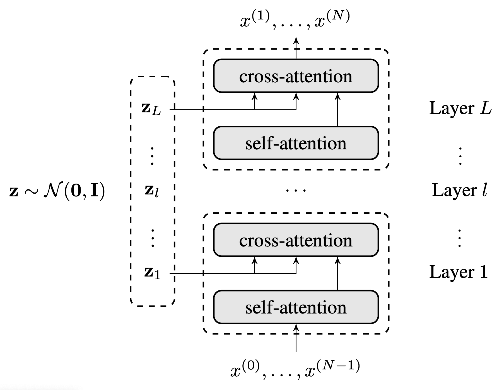
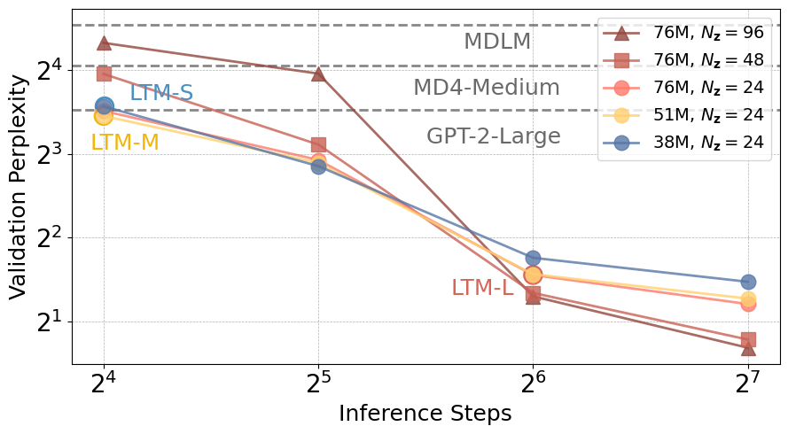
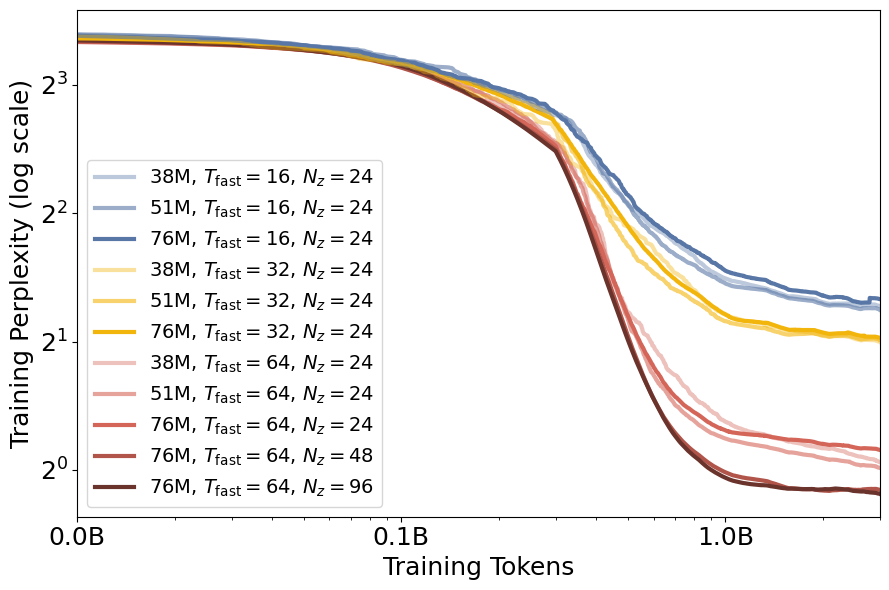
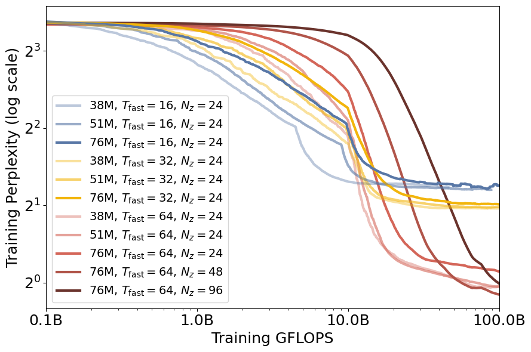
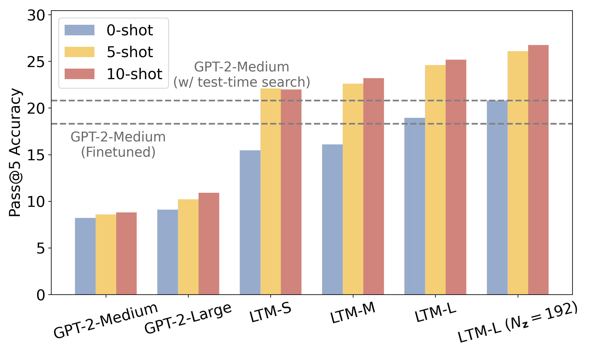

---
# ---------- Core metadata ----------
title:  "Latent Thought Models:"
subtitle: "Language models with explicit latent thought vectors and variational Bayes inference-time computation"
description: >
  We propose Latent Thought Models (LTMs) that add explicit "latent thought vectors" as internal abstract representations. Before generating text, LTMs first develop those internal thoughts, then use them to guide word-by-word generation. The model learns through a dual-rate process: fast learning that adapts thoughts for specific text and slow learning of general linguistic patterns. Compared to LLMs, LTMs achieve much better sample and computational efficiency. LTMs demonstrate in-context learning at a significantly smaller scale. Most importantly, LTMs introduce "inference-time computation" as a new scaling axis beyond LLMs, potentially transforming how we build efficient and generalizable AI systems.
keywords:
  - Inference-time computation
  - Language models
  - Variational Bayes
  - Latent variable model

# ---------- Authorship ----------
author-meta: "Deqian Kong"
authors:
  - name: "Deqian Kong"
    affiliations:
      - 1
      - 2
      - ' *'
    url: "https://sites.google.com/view/deqiankong/"
  - name: "Minglu Zhao"
    affiliations:
      - 1
      - ' *'
    url: "https://mingluzhao.github.io"
  - name: "Dehong Xu"
    affiliations:
      - 1
      - ' *'
    url: "https://dehongxu.github.io"
  - name: "Bo Pang"
    affiliations:
      - 3
    url: "https://bpucla.github.io"
  - name: "Shu Wang"
    affiliations:
      - 1
    url: "https://scholar.google.com/citations?user=uPk5l1EAAAAJ&hl=en"
  - name: "Edouardo Honig"
    affiliations:
      - 1
    url: "http://www.stat.ucla.edu/~edouardohonig/"
  - name: "Zhangzhang Si"
    affiliations:
      - 4
    url: "https://www.kungfu.ai/person/zz-si"
  - name: "Chuan Li"
    affiliations:
      - 2
    url: "https://scholar.google.com/citations?user=hoZesOwAAAAJ&hl=en"
  - name: "Jianwen Xie"
    affiliations:
      - 2
      - ' **'
    url: "http://www.stat.ucla.edu/~jxie/"
  - name: "Sirui Xie"
    affiliations:
      - 1
      - ' **'
    url: "https://siruixie.com"
  - name: "Ying Nian Wu"
    affiliations:
      - 1
      - ' **'
    url: "http://www.stat.ucla.edu/~ywu/research.html"
affiliations:
  - id: 1
    name: "UCLA"
  - id: 2
    name: "Lambda, Inc."
  - id: 3
    name: "Salesforce Research"
  - id: 4
    name: "KUNGFU.AI"
  - id: ' *'
    name: "Equal Contribution"
  - id: ' **'
    name: "Equal Advising"


# ---------- Links shown as buttons ----------
links:
  - label: "Paper (arXiv)"
    url: "https://arxiv.org/abs/2502.01567"
    icon: "file-alt"
  # - label: "Paper (PDF)"
  #   url: "https://arxiv.org/pdf/2505.07859v1" 
  #   icon: "file-pdf"
  # - label: "OpenReview"
  #   url: "https://openreview.net/forum?id=dsBjxI6l8W"
  #   icon: "comments"
  - label: "Code (GitHub)"
    url: 
    icon: "code"

# ---------- Optional SEO / social ----------
canonical: "https://arxiv.org/abs/2502.01567"
# hero_image: "arc_example.png"  # Replace with an appropriate image from the paper

# ---------- Footer ----------
owner:  "Deqian Kong"
year:   2025
license: "CC BY-SA 4.0"
license_url: "https://creativecommons.org/licenses/by-sa/4.0/"
---

<div class="text-center -mt-20 text-gray-600">
  Jump to: [TL;DR](#tldr), [Introduction](#introduction), [Key Findings](#key-findings), [Conclusion](#conclusion), [Acknowledgements](#acknowledgements), [Related Links](#related-links), [Cite](#bibtex)
</div>


## TL;DR {#tldr}
We introduce Latent Thought Models (LTMs), a novel class of language models that incorporate explicit **latent thought vectors** following a prior model in latent space. LTMs use a dual-rate optimization process within the variational Bayes framework: fast inference-time computation for latent vectors and slow learning of decoder parameters. This approach achieves superior sample and parameter efficiency compared to autoregressive models and introduces **inference-time computation** as a new scaling dimension beyond traditional LLMs.

<div class="mt-10" style="max-width: 700px; margin: 0 auto;">
  
  <p style="margin-top: 8px; font-size: 14px; color: #555; text-align: left;">
    High-Level Overview: LTMs first develop internal latent thoughts vectors 𝑧, then use them to guide autoregressive text generation 𝑥 through a Transformer decoder.
  </p>
</div>

## Introduction
Current language models scale primarily through increasing parameters and training data, leaving inference-time computation largely unexplored. We introduce Latent Thought Models (LTMs) that incorporate explicit "thinking" before generation (or speaking).

**Key Inspirations**: 

(1) **Declarative vs. Procedural Memory**: Latent vectors parallel declarative/episodic memory with fast learning, while global decoder parameters mirror procedural memory with slow learning; 

(2) **Complementary Learning Systems: Fast and Slow**: Our dual-rate learning mirrors the hippocampus (rapid learning of specific experiences) and neocortex (slower learning of general knowledge). 

(3) **Language of Thought**: Latent vectors serve as "words" in an internal cognitive language—a "mentalese" that underlies our ability to learn and use natural languages, realizing a computational "think before speak" paradigm.

**Why This Matters**: LTMs unlock inference-time computation as a new scaling dimension—the process of finding better internal representations (posterior distributions of latent thought vectors). Just as humans can achieve better understanding by "thinking harder" about a problem, LTMs can use more inference-time computation to achieve better performance with significantly less training data and computation.

## Key Findings {#key-findings}

Our empirical studies reveal several important discoveries about LTMs' unique scaling properties and capabilities:

1. **Scaling Behaviors of Inference-Time Computation**
LTMs demonstrate a new scaling dimension beyond traditional model parameters. Performance consistently improves with more inference steps, as the model iteratively refines latent thought vectors to find better internal representations.

<div class="md:mx-10">

</div>

2. **Sample and Computational Efficiency**
LTMs achieve superior efficiency by leveraging inference steps and latent size to improve performance more effectively than simply scaling model parameters or training data.

<div class="md:mx-5 grid grid-cols-1 md:grid-cols-2 gap-4">



</div>

3. **Emergent In-Context Learning in Mathematics**
LTMs demonstrate emergent few-shot mathematical reasoning capabilities at remarkably small scales. The explicit latent thought modeling enables mathematical reasoning to emerge much earlier in model scaling than traditional approaches.

<div class="md:mx-20">

</div>

## Conclusion {#conclusion}

Latent Thought Models represent a significant advancement in language modeling by introducing explicit latent thought vectors and inference-time computation as a new scaling dimension. The dual-rate optimization within the variational Bayes framework enables superior sample and parameter efficiency while maintaining competitive generation quality. 

This work opens new directions for efficient language model design and suggests that explicit modeling of internal representations can unlock additional scaling dimensions beyond traditional approaches. The ability to trade model size for inference computation provides flexible deployment strategies for resource-constrained environments.

## Acknowledgements
We thank Ruiqi Gao and Kevin Murphy from Google DeepMind for insightful discussions and valuable suggestions. Y. W. was partially supported by NSF DMS-2015577, NSF DMS-2415226, and a gift fund from Amazon. We gratefully acknowledge the support of [Lambda, Inc.](https://lambda.ai) for providing the compute for this project.

## Related Links


## BibTeX {#bibtex}
If you consider citing us, feel free to use the bibtex-entry below.

<div class="code-block-wrapper">
  <button class="copy-button">Copy</button>

```bibtex
@article{kong2025latent,
  title = {Latent Thought Models with Variational Bayes Inference-Time Computation},
  author = {Kong, Deqian and Zhao, Minglu and Xu, Dehong and Pang, Bo and Wang, Shu and Honig, Edouardo and Si, Zhangzhang and Li, Chuan and Xie, Jianwen and Xie, Sirui and Wu, Ying Nian},
  booktitle = {Proceedings of the 42nd International Conference on Machine Learning (ICML)},
  year = {2025}
}
```
</div>
